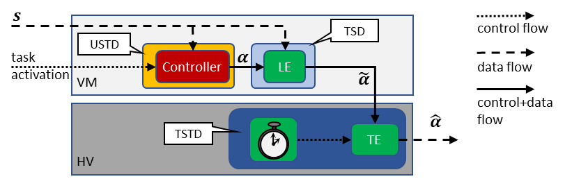
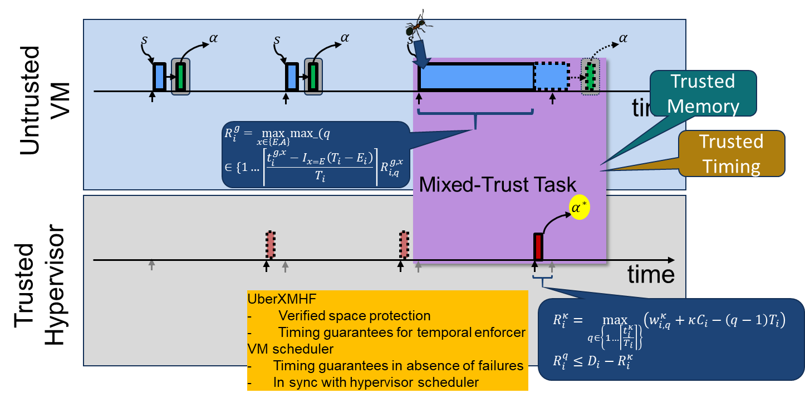
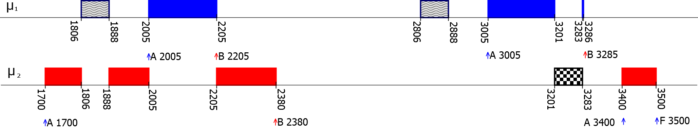
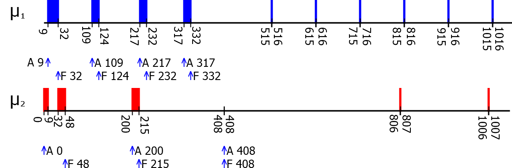

Verifying complex Cyber-Physical Systems (CPS) is increasingly important given the push to deploy safety-critcal autonomous features. Unfortunately, traditional verification methods do not scale to the complexity of these systems and do not provide systematic methods to proetct verified properties when not all the components can be verified. To address these challenges in this project we develop a real-time mixed-trust computing famework that combines verification and protection. The framework introduces a new task model, where an application task can have both an untrusted and a trusted part. The untrusted part allows complex computations supported by a full OS with a real-time scheduler running in a VM hosted by a trusted hypervisor (HV). The trusted part is executed by another scheduler within the hypervisor and is thus protected from the untrusted part. If the untrusted part fails to finish by a specified time, the trusted part is activated to preserve safety (e.g. prevent a crash) including its timing guarantees. This framework is the first allowing the use of untrusted components for CPS critical functions while preserving logical and timing guarantees even in the presence of malicious attackers. In this project we implemented the framework based on the XMHF hypervisor and the ZSRM scheduler and developed the schedulability analysis and the coordination protocol between the trusted and untrusted parts.

The mixed-trust computation framework is part of our enforcement-based verification where the output of un unverified component is validated by a verified logical enforcer (LE) who validates the safety of this actions. If the LE deems the output unsafe it replaces it with a safe one. Given that the unsafe component can delay the output beyond its deadline (as it executes in a real-time task) the trusted component in the hypervisor (that is also part of the task) executes a safe computation (with a safe output) before the deadline is missed. The untrusted component and the LE are combined into what we call a guesttask (GT) (given that it runs in the guest VM) and the trusted component running in the HV is considered a hypertask (HT). Together the GT and the HV form a mixed-trust task that is scheduled to ensure that their combined execution (with the rules discussed before) do not miss its deadline. The following figure depicts the architecture of the mixed-trust task.

<figure>

<figcaption>Mixed-Trust Architecture (published in [1])</figcaption>
</figure>

The mixed-trust task scheduling requires two schedulers: one running in the VM that schedules the GT preventing interference between GTs with budget enforcement. However, since the whole VM can be compromised the scheduler in th HV schedulers the HT protecting both its memory integrity and timing. The scheduler in the HV is implemented as a non-preemptive scheduler in order to simplify the logical verification of the HT given the lack of mature tools to verify interleaving functions. However, in the VM a preemptive scheduler is used. To guarantee deadlines for the whole mixed-trust tasks new schedulabiltiy equations for the mixed-preemption scheme and coordination where developed. In this combined scheduling scheme an enforcement timer E for each mixed-trust task is calculated as the last time when the HT can wait before it needs to execute to complete by the deadline. The following figure depicts an intuition of this scheme.

<figure>

<figcaption>Scheduling (published in [1])</figcaption>
</figure>

Our implementation was tested for temporal GT timing failure (failed to finish). The following figure presents a timeline of two mixed-trust tasks whose failures cause the execution of their respective HT (in gray patterns).

<figure>

<figcaption>Temporal Failures (published in [1])</figcaption>
</figure>

Similarly, we run experiments where the VM was killed completely with a call to panic from a kernel module and verified that the HTs were still running. The following figure shows a plot of such an experiment. All executions after 408 are HTs.

<figure>

<figcaption>Permanent Failures (published in [1])</figcaption>
</figure>

This video shows how a trusted component is used to make sure misbehaviors of the untrsuted components (or even attacks) do not crash the drone. You can see a drop of the drone that is "catched" by the trusted component (enforcer) ensuring that it does not crash. This particular video shows the enforcement behavior verified from the control-theoretic point of view relying on Lyapunov functions.

<figure>
<video muted width="750" controls='true'>
 <source src="enforced-drone.mp4" type="video/mp4">
 Browser does not support video
</video>
<figcaption>Drone Misbehaviors (published in [2])</figcaption>
</figure>

This video shows that, even when the kernel crashes, the drone can still keep hovering. This is the behavior enforced by the trusted component

<figure>
<video muted width="750" controls='true'>
  <source src="ht.mp4" type="video/mp4">
Browser does not support video
</video>
<figcaption>Drone Permanent Failure (published in [3])</figcaption>
</figure>

# Downloads

This is the repository of the kernel scheduler <a href="https://github.com/cps-sei/mixed-trust-zsrmv-public">Mixed-Trust ZSRM</a>

This is the repository to the hypervisor that must be installed <a href="https://uberxmhf.org/">uberxmhf</a>

# References

1. Dionisio de Niz, Bjorn Andersson, Mark Klein, John Lehoczky, Amit Vasudevan, Hyoseung Kim, and Gabriel A. Moreno.
Mixed-Trust Computing for Real-Time Systems. IEEE International Conference on Embedded and Real-Time Computing Systems and Applications (RTCSA), 2019.

2. Dionisio de Niz. SEI Research Review 2021 Rapid Certifiable Trust. Presentation Slides. DM21-0814.

3. Dionisio de Niz. RCT Video Demos. Presentation Slides. DM21-0878.

