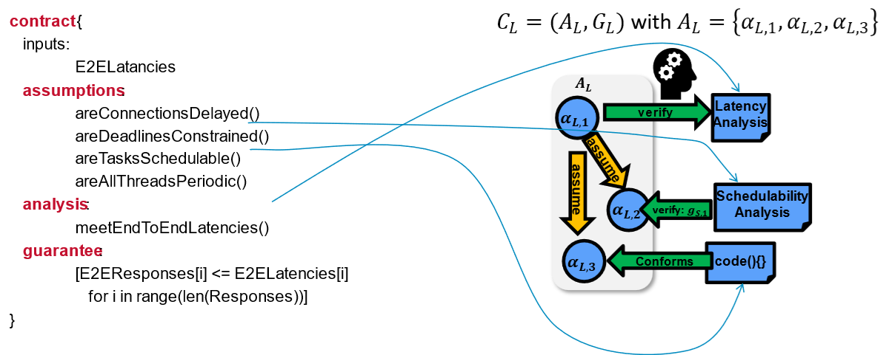
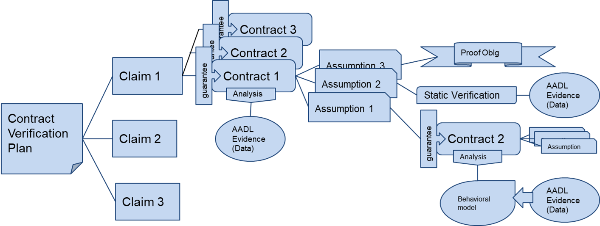
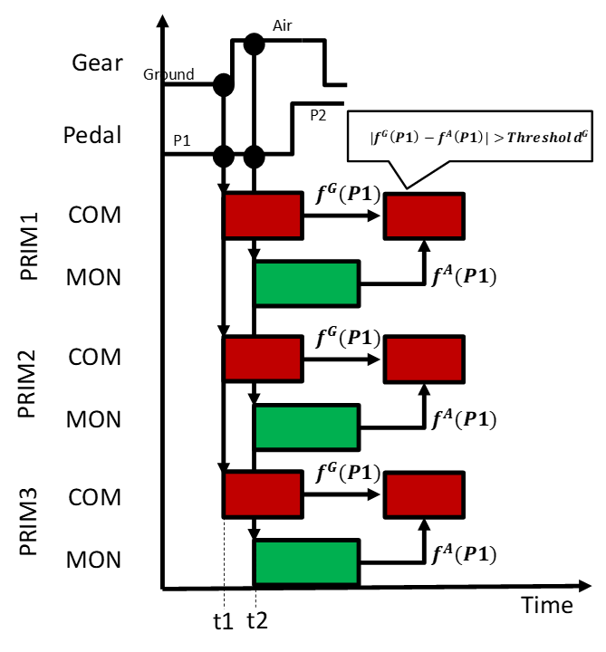
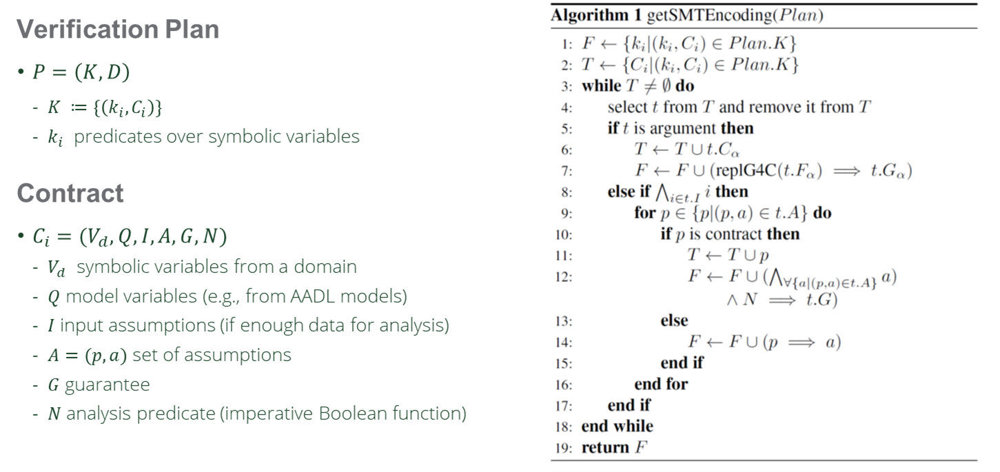
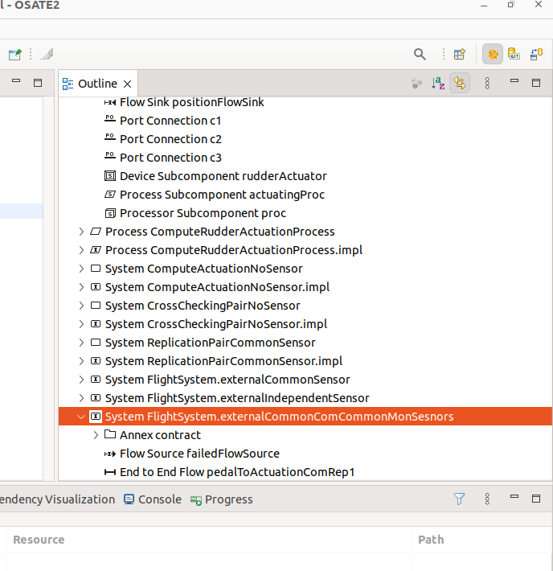
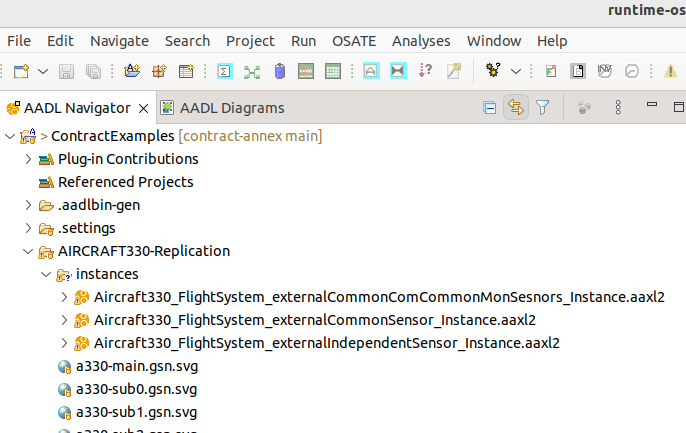
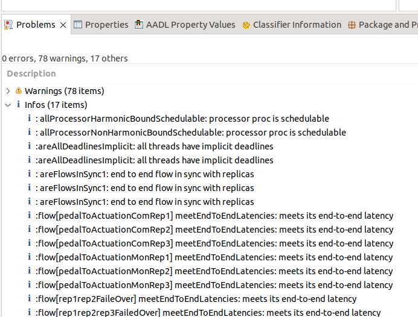

The Symbolic Assurance Refinement creates an argumentation based on verification analysis from different domains (real-time verification, logical verification, control-theoretic verification). For each analysis we create a contract that specifies what are the assumptions of the analysis and what are the guarantees that it provices as shown in the figure below.

<figure>

<figcaption>Analysis Contracts (published in [1])</figcaption>
</figure>

The assumptions of the analysis contract can be validated by simple comparisons with the system model if we have the information, with yet another analysis contract if the verification procedure of the property is complex enough, or it can be deferred as a proof obligation. 

# Argumentation

To automate certification, a verification plan is created with the certification claims using SMT (Satisfiability Modulus Theory). Then a number of analysis contracts are added to the plan to would verify different parts of the certification claims. The each analysis contract will use other contracts to satisfy other assumptions, creating an argumentation three as shown in the figure below.

<figure>

<figcaption>Certification Argumentation (published in [1])</figcaption>
</figure>

# A Flight Incident Sample Argumentation with SAR

As part of our engagement with the CPS and certification community we created the ASERT workgroup (https://asertw.org) with participation from the FAA, DOT&E, DTVV, NASA, Boeing, LMCO and others. The work in this group is structured as a set of experiments that evaluates the development of technology for automated certification. In the first experiment, named Experiment Zero we model the case of a triple computer failure during the landing of flight CI202 in Taipei in 2020. More specifically, during the landing, the plane bounced of the ground a couple of times creating a channel asynchrony between self-checking pairs. Self checking pairs are function executed in different processors and developed by different teams that calculate the same value. The value calculated by a pair is compared with each other and if they differ by a certain amount, it is assumed that the calculation is incorrect and the system fails over to another replica of this pair. In the plane from the incident there were three replicas and the three failed one after another.

## Channel Asynchrony

The failure was explained as a channel asynchrony, were the self-checking pair has two modes of operation: air and ground. In the air the functions calculate the actuation to control the rudder, and in the ground the actuation for the wheels of the aircraft. Unfortunately, the bouncing of the plane made one of the functions of the pair to calculate the actuation of the rudder and the other of the wheels. Hence, the comparison failed and replica failed. This occured in the three computers one after another. A diagram of the channel asynchrony is shown in the following figure.

<figure>

<figcaption>Channel Asynchrony (published in [1])</figcaption>
</figure>

## Verification plan

We created a verification plan that used real-time scheduling to verify the end-to-end timing requirements, the probabilistic Fault-Tree Analysis to validate the requirements of the availability, and a contract to specify that the maximum sensing (input) jitter between self-checking pair components needed to be zero (we explored other options but only this is presented in the report). The top level verification plan is shown in the following figure.

<figure>

<figcaption>Constrain Satisfaction Encoding (published in [2])</figcaption>
</figure>

With this plan we verified that if each component in the self-checking pair uses its own sensor and thread to read the sensor then it is not possible to ensure that the input jitter will be zero. Hence, we modify the architecture and used a single sensor and thread per self-checking pair that ensures that both self-checking pair functions received the same sensor readings. 

# Flight Incident Analysys Video Presentation and Demo 

This is a video presentation and demo of the flight incident analysis.

<video height="500" controls>
  <source src="images/flight-incident-analysis-symbolic-argumentation-and-demo.mp4" type="video/mp4">
Your browser does not support the video tag.
</video>

# Installing SAR

SAR is implemented as a plugin to the OSATE tool (osate.org). In order to install it you first need to install python 3.10 and then install the z3py ([Z3 solver package for python](https://pypi.org/project/z3-solver/)).

Then install OSATE and the SAR plugin with the following instructions:

1. Install OSATE 2.12.0 (or the nightly build, currently 2.12.91) following the instructions at ([OSATE Installation](https://osate.org/download-and-install.html))
2. Start OSATE and go to Help > Install New Software...
3. Type https://osate-build.sei.cmu.edu/p2/contract-annex/ in the "Work with" field, then hit Enter. If you've installed the contract annex before and want to update, you can select it from the dropdown.
 	"Contract" and "Contract (Sources)" should then show up in the dialog.
4. Select the checkbox next to "Contract" and click Next >
 	A dialog window "Install Details" should appear for the initial installation, if the annex is already installed and an update is available, a dialog should appear that says something like "Contract feature is already installed, It will be updated"
5. If it's the first installation: Click Next, then, if asked accept the license and click Finish. 
 	Otherwise click Finish.
6. If you get an error dialog that contains the text "An error occurred while collecting items to be installed" you can try again but in step 4 also uncheck the checkbox "Contact all update sites during install to find required software"
7. A dialog Trust will probably show up:
 	Check the box next to "Unsigned" in the upper table, then click on Trust Selected to continue.
8. Click Restart now to activate the annex

You can download sample aadl models and contracts from: ([Annex source code and examples](https://github.com/osate/contract-annex.git))

# CI202 Flight Incident Models

Within the contract-annex sample aadl models and SAR verification plans the folder <b>AIRCRAFT330-Replication</b> contains a number of models within the aadl file: <b>Aircraft330.aadl</b>.

Two of this model implementations reflect the original design with the channel asynchrony (as interpreted by the ASERT team) and the other the modified one as described in the report in [1]. 

1. Original model with channel asynchrony : <b>System FlightSystem.CommonComCommonMonSesnors</b>.

2. Modified model without channel asynchrony: <b>System flightSystem.externalIndependentSensors</b>.

It is worth noting that both models at the end of the system description you can find the reference to the verification plan used for this specific system. For instance for the <b>System FlightSystem.externalCommonComCommonMonSesnors</b> the line 1340 specifies the plan as:

<verbatim>
			annex contract {**
				verify FlowSynchronizationContract::verifySynchronization;
			**};
</verbatim>

## Running The Verification Plan

To run the verification plan you need to :

1. Select the system where the verification plan will be run in the "Outline" window on the right as shown in the figure below.

<figure>

<figcaption>OSATE Outline Window</figcaption>
</figure>

2. Right-click and select the "Instantiate" option. This will create an instance that will show up in the "instances" subfolder of the project as show in the figure below.

<figure>

<figcaption>Instances</figcaption>
</figure>

3. Click the instance on the instance window as shown in the figure above.

4. Select the menu "Analyses->Analysis Contracts->Execute Verification Plans"

5. If the verification plan finds a problem it will show it as an "Error" marker in the "Problems" window on lower part of OSATE as shown in the figure below.

<figure>

<figcaption>Problems window with errors</figcaption>
</figure>

In this window, double clicking on the error marker will take you to the instance component where the error occur. Right-clicking on this component and selecting "Goto Instance Object Source" will take you to the definition of the object in the AADL file.

6. If no error occured, the problems window shows under the "Infos" subtree all the analyses run by the verification plan argumentation hierarchy. It is possible to double click the marker to navigate to the instance component where the analysis result applies and from there navigating to the AADL source by right-clicking and selecting "Goto Instance Object Source" as well.

<figure>

<figcaption>Problems window without errors</figcaption>
</figure>

## Generating a Goal Structure Notation (GSN) graph view of the verification plan

It is possible to generate a GSN graph from the plan that follows the verification plan to simplify the navigation. To do this:

a. Open the verification plan by pressing Ctrl and click on the verification plan in the aadl file (e.g. line 1340 of the flight system example above).

b. right-click in the "Outline" window the verification plan and select the menu "Generate YAML-GSN".

This will generate a set of file in the subfolder "yaml-gen". You can then double click "svg" file with the name of the verification plan, e.g. <b>verifySynchronizagion.gsn.svg</b>. 

This will open the GSN and you will able to click each of the nodes to navigate the argumentation. 

Clicking on an analysis node (circle) will take you to the problems window to the error marker of the info marker depending on the last execution of the verification plan.

# References

1. Dionisio de Niz, Bjorn Andersson, Mark H. Klein, John Lehoczky (Carnegie Mellon University), Hyoseung Kim (University of California, Riverside), George Romanski (Federal Aviation Administration), Jonathan Preston (Lockheed Martin Corporation), Daniel Shapiro (Institute of Defense Analysis), Floyd Fazi (Lockheed Martin Corporation), Douglas Schmidt (Vanderbilt University), David Tate (Institute of Defense Analysis), Gordon Putsche (The Boeing Company), Ronald Koontz (Boeing Company).  
Encoding Verification Arguments to Analyze High-Level Design Certification Claims: Experiment Zero (E0).  
Technical Report ([ASERT Workgroup](https://asertw.org)).

2. Dionisio de Niz and Lutz Wrage.  
Symbolic Refinement for CPS.  
ACM SIGAda Ada Letters 43(1):88-93. DOI 10.1145/3631483.3631498. 2023

